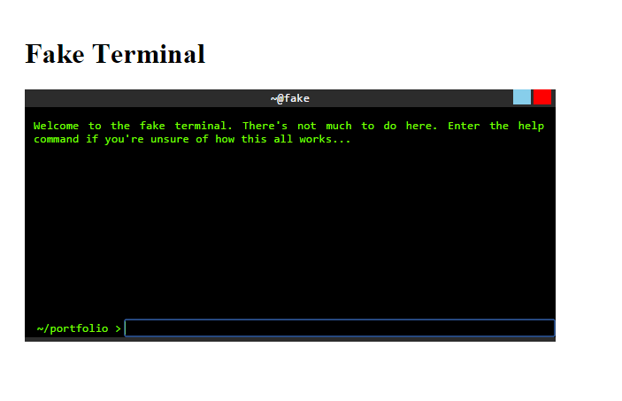

This is the first version of the fake terminal I was working on for my fake ubuntu site. There is jquery code but it doesn't really do anything. This is just to show off the css. 

What it looks like:
